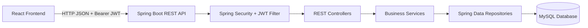
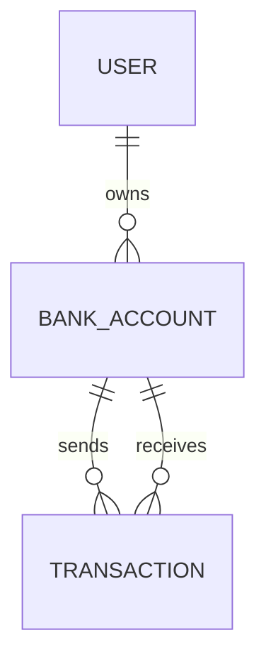

# Banking System Architecture

## Purpose

This document is the source of truth for the current structure of the Banking Management System. Every new feature must follow these boundaries and update this document when it adds or changes:

- A backend module, service, controller, endpoint, entity, DTO, repository, or security rule
- A frontend route, page, component, context, API client method, or shared UI behavior
- A database relationship or persisted field
- A cross-cutting concern such as validation, authorization, notifications, logging, or AI/ML scoring

Update the relevant section and the change log as part of the same feature change.

## System Overview

The application is a full-stack system with two independently runnable applications:

- **Backend:** Spring Boot REST API on port `8080`
- **Frontend:** React 19 application served by Vite, normally on port `5173`
- **Database:** MySQL in normal operation; H2 is available for tests
- **Authentication:** Stateless JWT access and refresh tokens



## Repository Layout

```text
banking/
├── ARCHITECTURE.md
├── README.md
├── banking/
│   ├── pom.xml
│   └── src/
│       ├── main/java/com/example/banking/
│       │   ├── config/          Spring and OpenAPI configuration
│       │   ├── controller/      REST API endpoints
│       │   ├── dto/             API request and response models
│       │   ├── entity/          JPA persistence models
│       │   ├── exception/       Domain exceptions and global responses
│       │   ├── repository/      Database access abstractions
│       │   ├── security/        JWT authentication and authorization
│       │   ├── services/        Business rules and transactions
│       │   └── BankingApplication.java
│       ├── main/resources/      Runtime and test configuration
│       └── test/java/           Backend tests
└── banking-frontend/banking-frontend/
    ├── package.json
    └── src/
        ├── components/          Pages and reusable UI components
        ├── context/             Auth, notification, and toast state
        ├── services/api.js      Central Axios API client
        ├── utils/validation.js  Client-side validation helpers
        ├── App.jsx              Routes and application composition
        ├── App.css
        ├── index.css
        └── main.jsx             React entry point
```

## Backend Architecture

The backend uses a layered architecture:

```text
HTTP request
  -> Security filter chain
  -> Controller
  -> Service
  -> Repository
  -> JPA entity / database
  -> DTO response
```

### Controllers

Controllers are responsible for HTTP concerns only:

- Define route paths and HTTP methods
- Read request parameters, authenticated user details, and request bodies
- Validate or delegate request data
- Call one or more services
- Return DTOs or structured response bodies
- Declare endpoint documentation and access boundaries

Current controllers:

- `AuthController`: registration, login, token refresh, and authentication validation
- `UserController`: profile operations
- `BankAccountController`: account creation, account lookup, deposits, withdrawals, transfers, and transaction history
- `AdminController`: administrative users, accounts, statistics, account state changes, and daily limit resets
- `InsightController`: authenticated read-only financial insight endpoints

Controllers must not contain database queries or substantial business logic.

### Services

Services own business rules and transaction boundaries:

- `UserService`: user registration and profile behavior
- `AccountService`: account lifecycle, account status, and daily transfer limits
- `TransactionService`: deposits, withdrawals, transfers, and transaction creation
- `TransactionHistoryService`: transaction lookup and history operations
- `AdminService`: administrative listings and system statistics
- `AiInsightService`: calculates an explainable Money Health Score from the authenticated user's accounts and transactions without changing banking data

`MockDataSeeder` is an opt-in configuration under the `mock-data` Spring profile. It creates one repeatable local test user, account, and transaction history through repositories. It is disabled unless the profile is explicitly activated.

Financial mutations must remain inside service methods marked with the appropriate Spring transaction behavior. New AI/ML features must not directly mutate balances, accounts, or transactions. They may provide an explainable recommendation or risk signal to the service or a read-only endpoint.

### Repositories

Repositories use Spring Data JPA for persistence and query operations:

- `UserRepository`
- `BankAccountRepository`
- `TransactionRepository`

Repository interfaces should contain data-access queries only. Filtering, scoring, validation, and workflow decisions belong in services.

### Entities and Relationships

The core persisted models are:

- `User`: identity, credentials, role, enabled/locked state, and login metadata
- `BankAccount`: account number, owner, balance, account status, transfer limits, and freeze metadata
- `Transaction`: transaction reference, source and destination accounts, amount, type, status, timestamps, description, and balance before/after

The important relationships are:



Use DTOs at the API boundary. Do not expose JPA entities directly from controllers.

### Security

`SecurityConfig` defines a stateless security model:

- Public routes include registration, login, refresh, public routes, and Swagger documentation
- `/api/admin/**` requires the `ADMIN` role
- `/api/insights/**` requires the `USER` or `ADMIN` role
- User routes require `USER` or `ADMIN`
- Other routes require authentication
- `JwtAuthenticationFilter` validates the bearer access token
- `UserDetailsService` loads users by email from `UserRepository` for login authentication
- BCrypt is used for password encoding
- CORS allows the configured local frontend origins

Every new endpoint must be intentionally classified as public, authenticated user, or admin-only. Do not rely only on frontend route protection.

### Errors and Validation

- Use request DTOs for input contracts.
- Reject invalid amounts and invalid account state in services.
- Use domain exceptions for expected banking failures.
- Let `GlobalExceptionHandler` produce consistent API error responses.
- Frontend validation improves usability but does not replace backend validation.

## Frontend Architecture

The frontend is a React single-page application composed in `App.jsx`.

### Routing and Access

`App.jsx` defines public and protected routes. `ProtectedRoute` checks authentication and, where required, the `ADMIN` role. `Layout` provides the shared application shell.

Current user workflows:

- Login and registration
- Dashboard and account overview
- Account creation
- Deposit and withdrawal
- Transfer
- Transaction history
- Profile management

Current admin workflows:

- System dashboard and statistics
- User listing
- Account listing
- Freeze, unfreeze, and close account
- Reset daily transfer limits

Frontend protection is a user experience boundary. The backend remains the authoritative authorization boundary.

### State and API Access

- `AuthContext`: current user and authentication lifecycle
- `NotificationContext`: application notifications
- `ToastContext`: transient toast state
- `services/api.js`: one Axios instance, JWT request interceptor, token refresh handling, and grouped API methods
- Components call API methods rather than constructing ad hoc Axios requests
- Components own page-level loading and interaction state

New API calls should be added to the appropriate API group in `services/api.js`, then consumed by a component or context. Avoid duplicating token handling in components.

## Feature Development Rules

Every feature should follow this sequence:

1. Define the user/admin behavior and access level.
2. Identify the owning backend service and existing entity data.
3. Add or update request/response DTOs if the API contract changes.
4. Add repository queries only when existing queries cannot support the feature.
5. Implement business logic in a service.
6. Expose it through a controller with explicit security rules.
7. Add the matching API client method in `services/api.js`.
8. Add or update the React component, route, or context.
9. Add focused backend and frontend tests where the behavior is testable.
10. Update this document's relevant sections and change log.

### Financial and AI/ML Feature Rules

The first AI/ML features should be basic, explainable, and read-only:

- Financial health or cash-flow insights
- Low-balance forecasting
- Transaction explanations
- Transaction anomaly or risk scoring
- Admin attention prioritization

AI/ML logic belongs in a dedicated backend service such as `AiInsightService` or `RiskScoringService`. It must:

- Use approved transaction and account data only
- Return a reason or contributing factors with every score
- Never bypass authentication or authorization
- Never change balances or freeze accounts automatically
- Avoid exposing another user's private financial data
- Be independently testable without requiring a live external model
- Fail safely when there is insufficient history

A model or external AI provider must not be added to the transaction mutation path until its latency, failure behavior, privacy impact, and test strategy are documented.

## API Conventions

- Base path: `/api`
- JSON request and response bodies
- Bearer access token in the `Authorization` header
- Pagination uses `page` and `size` where supported
- Use resource-oriented paths and existing role prefixes (`/api/user`, `/api/admin`, `/api/accounts`)
- Keep response contracts in DTOs
- Document new endpoints with OpenAPI annotations when appropriate

## Testing and Verification

Before considering a feature complete:

- Run backend tests with Maven.
- Run frontend lint and production build.
- Verify role restrictions for new endpoints.
- Verify invalid input and expected domain failures.
- Verify that financial mutations preserve transaction history and balance consistency.
- Verify frontend loading, success, and error states.
- Update the relevant testing documentation when startup or test procedures change.

## Change Log

| Date | Change | Architectural impact |
|---|---|---|
| 2026-09-11 | Added architecture source of truth | Documented current Spring Boot, React, JWT, JPA, database, API, testing, and future AI/ML boundaries |

## Feature Update Checklist

When adding a feature, update this file with:

- The new backend package, class, service, controller, endpoint, or data field
- The new frontend component, context, route, or API method
- The security role and data-access boundary
- Any new persistence relationship or migration/configuration requirement
- The test command or verification scenario used
- One entry in the change log
